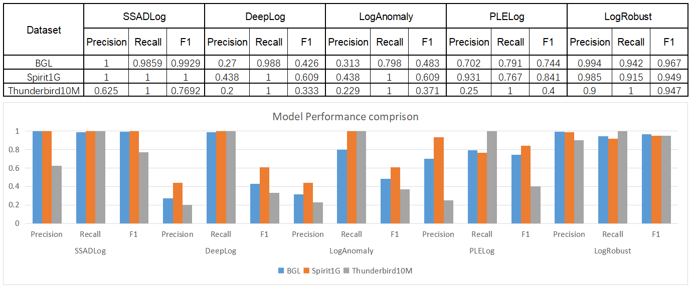

SSADLog: 
=================================================

## Paper

Repository for the paper: 

**Abstract:** 

## Architecture

## Requirements
[requirements file](./requirements.txt)

## Experiment Setup
- Set up virtual environment(Linux as example)
```
python3 -m venv advenv
source advenv/bin/activate
```
- Download SSADLog code, use below command to install environment dependencies:
```
cd SSADLog
pip install -r requirements.txt
```
- Download datasets(BGL as an example):
```
mkdir -p data/raw
mkdir -p data/split
cd data/raw
wget https://zenodo.org/record/8196385/files/BGL.zip
unzip BGL.zip
cd ../..
```
- Pre-processing:

split to train_log and test_log
```
python tools/aug_split_log_newlines.py
```
continue to split test_log into 2 10% test datasets
```
python tools/aug_split_2tests.py
```
Queue based elimination of duplicate entries reduce numbers of log messages
```
python tools/reduce_duplication_train_60.py
python tools/reduce_duplication1_60.py
python tools/reduce_duplication2_60.py
```
convert to json file
```
python tools/convert_log2json.py data/split/BGL_train80_reduced_normal_60.log train_dataset_b.json
python tools/convert_log2json.py data/split/BGL_test10_1_reduced_60.log test1_dataset_b_60.json
python tools/convert_log2json.py data/split/BGL_test10_2_reduced_60.log test2_dataset_b_60.json

// The below 2 original test1 and test2 datasets are for comparison purpose
python tools/convert_log2json.py data/split/BGL_test10_1.log test1_dataset_b.json
python tools/convert_log2json.py data/split/BGL_test10_2.log test2_dataset_b.json
```
create a folder for save runing results
```
mkdir -p logs
```

## demo
make sure to activate the installed venv:
```
source advenv/bin/activate
```
- Train model: Train model with class_weights on train_dataset_b.json
```
python src/train_BGL_with_clean.py 2>&1 | tee logs/train_BGL_with_clean.log
```
- Test model:

**test1**: Use above saved model and test on small sample test1 logs test1_dataset_b_60.json
```
python src/test1_BGL_with_clean_b60.py 2>&1 | tee logs/test1_BGL_with_clean_b60.log
```
Use above saved model and test on original logs test1 dataset test1_dataset_b.json for comparison
```
python src/test1_BGL_with_clean.py 2>&1 | tee logs/test1_BGL_with_clean.log
```
- Fine tuning model:

**Human expert manualy work** here: need to verify and correct all labels in test1_b60_mismatch.json. The number of logs should be small. Add the new logs test1_b60_mismatch.json and train_dataset_b.json to generate train_dataset_b_new1.json.

**re-train**: Load model from above saved model and re_train, compare train result with train_BGL_with_clean.log(total dataset items:  mismatch: Val Loss: Precision: Recall: F1:)
```
python src/re_train_BGL_with_clean.py 2>&1 | tee logs/re_train_BGL_with_clean.log
```
**re-test1**: use above re-trained model and test on small sample test1 logs test1_dataset_b_60.json again. compare test result with test1_BGL_with_clean_b60.log(total dataset items:  mismatch: Val Loss: Precision: Recall: F1:)
```
python src/re_test1_BGL_with_clean_b60.py 2>&1 | tee logs/re_test1_BGL_with_clean_b60.log
```
Use above re-trained model and test on original logs test1 dataset test1_dataset_b.json for test efficiency and performance comparison
```
python src/re_test1_BGL_with_clean.py 2>&1 | tee logs/re_test1_BGL_with_clean.log
```
**new test2 prediction**: use above re-trained model and test on small sample test2 logs test2_dataset_b_60.json. Compare test result with re_test1_BGL_with_clean_b60.log(total dataset items:  mismatch: Val Loss: Precision: Recall: F1:)
```
python src/test2_BGL_with_clean_b60.py 2>&1 | tee logs/test2_BGL_with_clean_b60.log
```
Use above re-trained model and test on original logs test2 dataset test2_dataset_b.json for test efficiency and performance comparison
```
python src/test2_BGL_with_clean.py 2>&1 | tee logs/test2_BGL_with_clean.log
```

## Experiments Result

- Daily fine tuning time reduction


- Daily new logs test time reduction


- Model performance comparison


## Citation
If you find this project helpful for your research, please consider citing the following paper:
