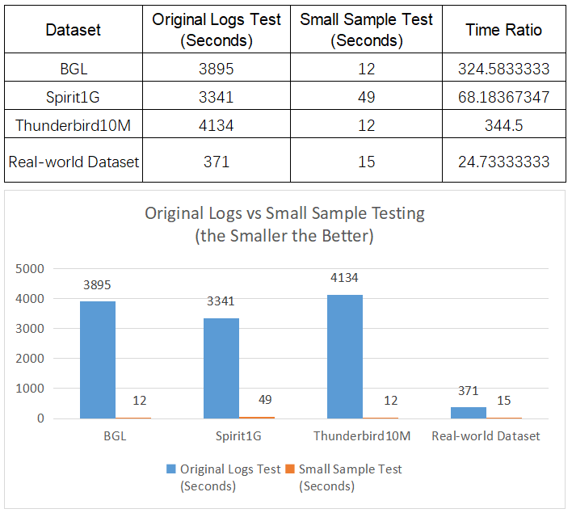

SSADLog: 
=================================================

## Paper
SSADLog: Whole Lifecycle Tuning Anomaly Detection with Small Sample Logs

[Repository for the paper](https://www.researchgate.net/publication/375629925_SSADLog_Whole_Lifecycle_Tuning_Anomaly_Detection_with_Small_Sample_Logs)

**Abstract:** 
Log messages play a critical role in system analysis and issue resolution, particularly in complex software-intensive systems that demand high availability and quality assurance. However, log-based anomaly detection faces three major challenges. Firstly, millions of log data poses a significant labeling challenge. Secondly, log data tends to exhibit a severe class imbalance. Thirdly, the task of anomaly detection in such massive datasets requires both high accuracy and efficiency. Numerous deep learning based methods have been proposed to tackle those challenges. Yet, a comprehensive solution that effectively addresses all these issues has remained elusive. After meticulously analyzing log messages from some stable systems, we have observed a common trend: the number of unique anomaly logs is consistently small. Based on this observation, we present a novel framework called ``Whole Lifecycle Tuning Anomaly Detection with Small Sample Logs'' (SSADLog). SSADLog introduces a hyper-efficient log data pre-processing method that generates a representative subset of small sample logs. It leverages a pre-trained bidirectional encoder representations from transformers (BERT) language model to create contextual word embeddings. Furthermore, a semi-supervised fine-tuning process is employed for enhancing detection accuracy. SSADLog distinguishes itself with its capability to achieve high-performance iterations by fine-tuning language models with small size log samples. Extensive experimental evaluations show that SSADLog greatly reduces the effort to detect anomaly log messages from millions of daily new logs and outperforms the previous representative methods across various log datasets in terms of precision, recall, and F1 score.

## Architecture


## Requirements
[requirements file](./requirements.txt)

## Experiment Setup
- Set up virtual environment(Linux as example)
```
python3 -m venv advenv
source advenv/bin/activate
```
- Download SSADLog code, use below command to install environment dependencies:
```
cd SSADLog
pip install -r requirements.txt
```
- Download datasets(BGL as an example):
```
mkdir -p data/raw
mkdir -p data/split
cd data/raw
wget https://zenodo.org/record/8196385/files/BGL.zip
unzip BGL.zip
cd ../..
```
- Pre-processing:

split to train_log and test_log
```
python tools/aug_split_log_newlines.py
```
continue to split test_log into 2 10% test datasets
```
python tools/aug_split_2tests.py
```
Queue based elimination of duplicate entries reduce numbers of log messages
```
python tools/reduce_duplication_train_60.py
python tools/reduce_duplication1_60.py
python tools/reduce_duplication2_60.py
```
convert to json file
```
python tools/convert_log2json.py data/split/BGL_train80_reduced_normal_60.log train_dataset_b.json
python tools/convert_log2json.py data/split/BGL_test10_1_reduced_60.log test1_dataset_b_60.json
python tools/convert_log2json.py data/split/BGL_test10_2_reduced_60.log test2_dataset_b_60.json

// The below 2 original test1 and test2 datasets are for comparison purpose
python tools/convert_log2json.py data/split/BGL_test10_1.log test1_dataset_b.json
python tools/convert_log2json.py data/split/BGL_test10_2.log test2_dataset_b.json
```
create a folder for save runing results
```
mkdir -p logs
```

## demo
make sure to activate the installed venv:
```
source advenv/bin/activate
```
- Train model: Train model with class_weights on train_dataset_b.json
```
python src/train_BGL_with_clean.py 2>&1 | tee logs/train_BGL_with_clean.log
```
- Test model:

**test1**: Use above saved model and test on small sample test1 logs test1_dataset_b_60.json
```
python src/test1_BGL_with_clean_b60.py 2>&1 | tee logs/test1_BGL_with_clean_b60.log
```
Use above saved model and test on original logs test1 dataset test1_dataset_b.json for comparison
```
python src/test1_BGL_with_clean.py 2>&1 | tee logs/test1_BGL_with_clean.log
```
- Fine tuning model:

**Human expert manualy work** here: need to verify and correct all labels in test1_b60_mismatch.json. The number of logs should be small. Add the new logs test1_b60_mismatch.json and train_dataset_b.json to generate train_dataset_b_new1.json. For Spirit10G and Thunderbird10M, we can do tuning purposed balancing processing to futher reduce the number of logs for training and testing.

**re-train**: Load model from above saved model and re_train, compare train result with train_BGL_with_clean.log(total dataset items:  mismatch: Val Loss: Precision: Recall: F1:)
```
python src/re_train_BGL_with_clean.py 2>&1 | tee logs/re_train_BGL_with_clean.log
```
**re-test1**: use above re-trained model and test on small sample test1 logs test1_dataset_b_60.json again. compare test result with test1_BGL_with_clean_b60.log(total dataset items:  mismatch: Val Loss: Precision: Recall: F1:)
```
python src/re_test1_BGL_with_clean_b60.py 2>&1 | tee logs/re_test1_BGL_with_clean_b60.log
```
Use above re-trained model and test on original logs test1 dataset test1_dataset_b.json for test efficiency and performance comparison
```
python src/re_test1_BGL_with_clean.py 2>&1 | tee logs/re_test1_BGL_with_clean.log
```
**new test2 prediction**: use above re-trained model and test on small sample test2 logs test2_dataset_b_60.json. Compare test result with re_test1_BGL_with_clean_b60.log(total dataset items:  mismatch: Val Loss: Precision: Recall: F1:)
```
python src/test2_BGL_with_clean_b60.py 2>&1 | tee logs/test2_BGL_with_clean_b60.log
```
Use above re-trained model and test on original logs test2 dataset test2_dataset_b.json for test efficiency and performance comparison
```
python src/test2_BGL_with_clean.py 2>&1 | tee logs/test2_BGL_with_clean.log
```

## Experiments Result

- Daily fine tuning time reduction


- Daily new logs test time reduction


- Model performance comparison


## Citation
Zhou, Zhisheng & Zhou, Meixiu & Wu, Axin & Xia, Jie & Liu, Weiping. (2023). SSADLog: Whole Lifecycle Tuning Anomaly Detection with Small Sample Logs. 10.21203/rs.3.rs-3588406/v1. 
